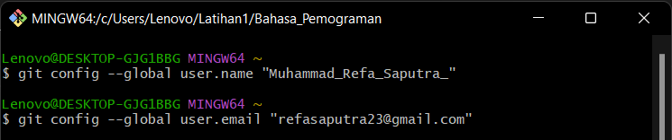
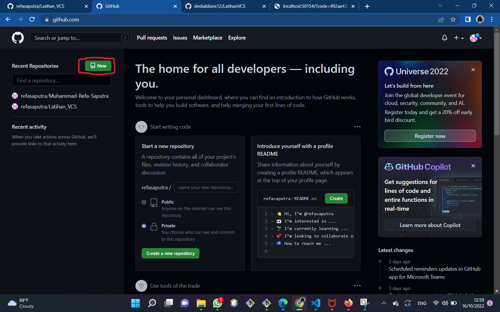

# Latihan_VCS
Tutorial cara penggunaan git

Pertama kalian harus instal terlebih dahulu software Git Lalu kalian bisa buka software tersebut

1.Login Git
Langkah pertama kalian adalah memasukan username dengan menggunakan perintah

$ git config --global user.name "UsernameAnda"

lalu kalian tambahkan juga email dengan menggunakan perintah

$ git config --global user.email "email anda"

 
 2.Login Github
Langkah kedua kalian bisa login ke dalam website github, Setelah kalian login akan muncul tampilan dashboard dari github tersebut

3.Buat Repository
Setelah berhasil login ke GitHub, Anda bisa mulai membuat repository. Klik tombol New pada menu Repositories untuk membuat repository baru.

1[Gambar 1](SS/3.png)

Kemudian kaliam akan diarahkan pada halaman untuk membuat repository baru seperti gambar di bawah ini.

1[Gambar 1](SS/4.png)
