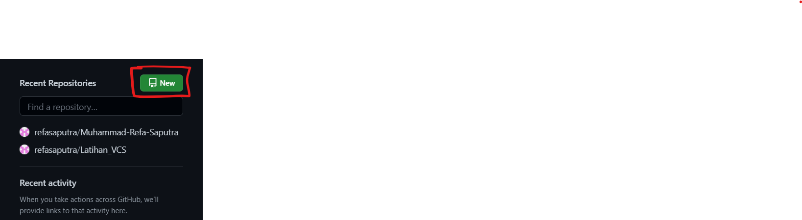
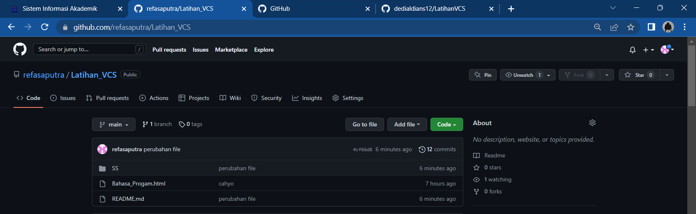

# Latihan_VCS
Tutorial cara penggunaan git

Pertama kalian harus instal terlebih dahulu software Git Lalu kalian bisa buka software tersebut

1.Login Git
Langkah pertama kalian adalah memasukan username dengan menggunakan perintah

$ git config --global user.name "UsernameAnda"

lalu kalian tambahkan juga email dengan menggunakan perintah

$ git config --global user.email "email anda"

 
 2.Login Github
Langkah kedua kalian bisa login ke dalam website github, Setelah kalian login akan muncul tampilan dashboard dari github tersebut

3.Buat Repository
Setelah berhasil login ke GitHub, Anda bisa mulai membuat repository. Klik tombol New pada menu Repositories untuk membuat repository baru.

Kemudian kaliam akan diarahkan pada halaman untuk membuat repository baru seperti gambar di bawah ini.

4.Buat Folder
Lalu kalian buat folder di localdisk koomputer kalian

jika sudah kalian klik kanan pada folder tersebut lalu klik Git Bash

Buat folder dengan menggunakan perintah dan buka folder tersebut

$mkdir latihan1

$cd latihan1

dan tambahkan file README.md dengan menggunakan perintah

$echo "#LatihanVCS" >> README.md

kemudian buat repository lokal menggunakan perintah

$git init

Untuk menambahkan file yang baru saja dibuat tersebut menggunakan perintah

$git add README.md

Untuk menyimpan perubahan yang ada kedalam database repository local, gunakan perintah

$git commit -m "first commit"

kemudian gunakan perintah

$git branch -M main

Setelah itu menambahkan remote repository. remote Repository merupakan repository server yang akan digunakan untuk menyimpan setiap perubahan pada local repository, sehingga dapat diakses oleh banyak user. dengan menggunakan perintah

$git remote add origin https://github.com/refasaputra/Latihan_VCS.git

Dan untuk mengirim perubahan pada local repository ke server gunakan perintah

$git push -u origin main

Dan kita bisa cek di repository langsung pada website github 

Sekian Dari Saya
Muhammad Refa Saputra

Mohon Maaf Bila Ada Kesalahan Namanya Manusia Tak Luput Dari Dosa dan Kesalahan
TERIMA KASIH

IG=Mohreffa_

FB=Muhammad Refa Saputra

